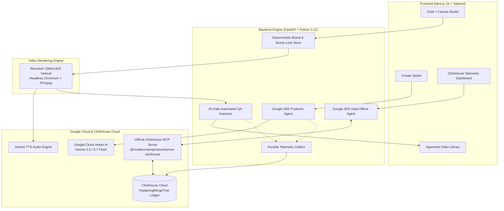

# FYF Video Pipeline — Agentic Cinema & Real-Time Telemetry

> **Track:** ClickHouse Partner Track  
> **Repository:** [https://github.com/ahk1542001-wq/fyf-video-pipeline](https://github.com/ahk1542001-wq/fyf-video-pipeline) (MIT License)  
> **Live Hosted Project:** [https://fyf-pipeline-605161166139.asia-southeast1.run.app](https://fyf-pipeline-605161166139.asia-southeast1.run.app)  
> **Demo Video (YouTube):** [https://youtu.be/9MYzaFjR0ck](https://youtu.be/9MYzaFjR0ck)  
> **Devpost Submission:** [DEVPOST_SUBMISSION.md](DEVPOST_SUBMISSION.md)  

An evidence-led business video studio orchestrating Google ADK agents, immutable brand locks, 20 automated QA gates, and real-time ClickHouse Cloud telemetry with an official MCP Data Officer.

---

## Table of Contents

1. [Overview & Core Value](#overview--core-value)
2. [Demonstrated Runtime Use of Google Cloud](#demonstrated-runtime-use-of-google-cloud)
3. [Demonstrated Runtime Use of ClickHouse Cloud & MCP](#demonstrated-runtime-use-of-clickhouse-cloud--mcp)
4. [Brand Lock & Granular Scene Protection](#brand-lock--granular-scene-protection)
5. [Architecture](#architecture)
6. [Step-by-Step Instructions to Run Locally](#step-by-step-instructions-to-run-locally)
7. [Running Automated Tests](#running-automated-tests)
8. [Deploying to Google Cloud Run](#deploying-to-google-cloud-run)
9. [Open Source License](#open-source-license)

---

## Overview & Core Value

Producing high-impact business video explainers for emerging markets like Myanmar is slow and expensive. Generic AI video generators suffer from three critical production flaws:
1. **Uncontrolled Brand Drift:** Modifying one sentence in a prompt often regenerates the whole video, randomly altering approved brand colors, characters, or established visual assets.
2. **Broken Regional Typography:** Headless renderers and off-the-shelf tools butcher complex Burmese Unicode diacritics and font layouts.
3. **Zero Cost & Failure Visibility:** Teams burn through model API quotas with no audit trail of which scene, provider call, or retry consumed their budget.

**FYF Studio** solves this with an end-to-end video pipeline where:
- Approved scenes are frozen with **immutable Brand Locks**.
- 1080x1920 vertical MP4s are deterministically rendered with **Remotion** and Burmese font fallbacks.
- Every single production run dual-writes sanitized telemetry into **ClickHouse Cloud**.
- Operators can question live telemetry through our built-in **Google ADK Data Officer** using the official **ClickHouse MCP server**.

---

## Demonstrated Runtime Use of Google Cloud

This repository actively imports and executes Google Cloud SDKs and models at runtime (not just named in docs):

### 1. Google Cloud Vertex AI & GenAI SDK
- **Imported in code:**
  - `backend/vertex_client.py`: imports `google.genai` and `google.genai.types`.
  - `backend/agent/runner.py`: builds Vertex-backed runtime client with `vertex_client_kwargs()`.
  - `backend/final_visual_qa_vertex.py`: calls Gemini on Vertex AI to inspect rendered frames for visual evidence and brand compliance.
- **Models used:**
  - `gemini-2.5-flash` / `gemini-3.7-flash` for high-speed script synthesis, structured storyboard output, and visual shot planning.
  - Forced function calling with strict Pydantic schemas (`ToolConfig.ANY`) to guarantee zero schema drift under load (see [ADR-003](docs/decisions/ADR-003-forced-function-calling.md)).

### 2. Google Agent Development Kit (`google-adk`)
- **Imported in code:**
  - `backend/agent/fyf_producer.py`: initializes `google.adk.agents.Agent` for the Creative Director and Producer roles with custom toolsets.
  - `backend/agent/data_officer.py`: uses `google.adk.agents.Agent` and `google.adk.tools.mcp.MCPToolset` to connect agent reasoning to database tools.

### 3. Google Gemini Text-to-Speech (TTS)
- **Imported in code:**
  - `voice_service/gemini_tts.py`: synthesizes voiceover audio using Gemini voice models (`Voice: Sadaltager`), extracting frame-accurate phonetic viseme cues for character lip-sync mouth animation.

### 4. Google Cloud Run & Cloud Build
- **Deployment:**
  - `Dockerfile`: Multi-stage container bundling Node 20, Python 3.11, Chromium, FFmpeg, and Remotion.
  - `scripts/deploy_cloudrun.sh`: Automated build and deployment to Google Cloud Run (Region: `asia-southeast1`).

---

## Demonstrated Runtime Use of ClickHouse Cloud & MCP

ClickHouse is the core analytical telemetry backbone of FYF Studio:

### 1. Official ClickHouse Model Context Protocol (`mcp-clickhouse`)
- **Imported and executed in code:**
  - `backend/agent/data_officer.py`: Launches the official `@modelcontextprotocol/server-clickhouse` as a stdio MCP subprocess and binds its tools directly into Google ADK via `MCPToolset`.
  - Endpoint `POST /api/insights` in `backend/main.py`: Accepts natural-language questions from operators, forwards them to the Data Officer, which autonomously executes live ClickHouse queries (`list-tables`, `describe-table`, `run-query`) and returns verified numbers badged *"✓ Answered from a live ClickHouse query"*.

### 2. Replay-Safe ClickHouse Cloud Schema
- **Implemented in `backend/clickhouse_telemetry.py`:**
  - Connects to ClickHouse Cloud on GCP (`asia-southeast1` over port 8443 with TLS).
  - Automatically provisions 4 core tables using `ReplacingMergeTree(ingestion_timestamp)`:
    1. `video_pipeline_jobs`: Tracks job status, render duration, token count, cost in USD, and language.
    2. `video_qa_records`: Records 20 automated QA gate checks, violations, and pass/fail state.
    3. `video_scene_telemetry`: Per-scene render latency, visual evidence counts, and mouth-cue counts.
    4. `video_vertex_calls`: Granular provider log of every Gemini API invocation, thinking time, and token breakdown.

### 3. Durable Outbox Pattern
- **Implemented in `backend/telemetry_outbox.py`:**
  - Writes telemetry events locally to append-only JSONL files first.
  - A background outbox worker drains events into ClickHouse Cloud with exponential backoff and replay-safe deduplication, guaranteeing zero telemetry loss during network interruptions.

### 4. Sub-150ms Query Presets
- **Implemented in `backend/telemetry_store.py`:**
  - `Cost Intelligence` query: aggregates status, token counts, and cost in **47ms**.
  - `Jobs Overview` query: returns production history in **147ms**.

---

## Brand Lock & Granular Scene Protection

To eliminate uncontrolled AI drift, FYF implements deterministic brand controls:
- **Story Lock:** Once an initial script or brief is approved, operators activate Story Lock. Future renders and edits strictly use this approved source.
- **Granular Scene Locks (`backend/projects/scene_locks.py`):** Operators can independently freeze specific scenes (`narration`, `visuals`, or `timing`).
- **Fail-Closed Enforcement (`backend/projects/commands.py`):** When the AI Creative Director proposes edits, the backend inspects active lock scopes. Any proposal that touches a locked scene is rejected with a structured `lock_conflict` error before any state changes occur.

---

## Architecture



---

## Step-by-Step Instructions to Run Locally

### Prerequisites
- **Python 3.11+**
- **Node.js 20+** and `npm`
- **FFmpeg** installed on your system (`brew install ffmpeg` on macOS)
- A Google Cloud Vertex AI API key / Service Account
- A ClickHouse Cloud instance (or local ClickHouse server)

### 1. Clone the Repository

```bash
git clone https://github.com/ahk1542001-wq/fyf-video-pipeline.git
cd fyf-video-pipeline
```

### 2. Environment Configuration

Copy the sample environment file:
```bash
cp .env.example .env
```

Configure your `.env` with your credentials:
```env
# Google Cloud Vertex AI
FYF_VERTEX_API_KEY=your_gemini_api_key_here
FYF_RUNTIME_MODE=hackathon

# ClickHouse Cloud
CLICKHOUSE_HOST=your_cluster.clickhouse.cloud
CLICKHOUSE_PORT=8443
CLICKHOUSE_USER=default
CLICKHOUSE_PASSWORD=your_secure_password
CLICKHOUSE_DATABASE=default
CLICKHOUSE_SECURE=true
```

### 3. Backend Setup

```bash
# Create and activate virtual environment
python3 -m venv .venv
source .venv/bin/activate

# Install dependencies
pip install -r requirements.txt

# Start FastAPI server on port 8000
python -m uvicorn backend.main:app --host 127.0.0.1 --port 8000
```

### 4. Frontend Setup

In a separate terminal window:
```bash
cd frontend

# Install dependencies
npm install

# Start Next.js on port 3001
npm run dev -- --port 3001
```

### 5. Access the Web Application

Open your browser:
- **Create Studio:** [http://localhost:3001](http://localhost:3001)
- **Approved Video Library:** [http://localhost:3001/library](http://localhost:3001/library)
- **ClickHouse Telemetry & Data Officer:** [http://localhost:3001/telemetry](http://localhost:3001/telemetry)

---

## Running Automated Tests

The repository contains comprehensive unit, integration, and contract tests:

### Backend Tests (Pytest)
```bash
source .venv/bin/activate

# Run ClickHouse telemetry and Data Officer tests
pytest backend/test_telemetry_store.py

# Run pipeline quality gate and lock store tests
pytest backend/test_pipeline.py backend/test_granular_locks.py

# Run full backend test suite
pytest
```

### Remotion Contract Tests (Node.js)
```bash
cd remotion
node --test src/productionContract.test.mjs
```

### Frontend End-to-End Tests (Playwright)
```bash
cd frontend
npx playwright test e2e/telemetry-insights.spec.ts
```

---

## Deploying to Google Cloud Run

To deploy the unified container to Google Cloud Run:

```bash
# Log in to Google Cloud
gcloud auth login

# Set your project ID and run deployment
PROJECT_ID="your-gcp-project-id" bash scripts/deploy_cloudrun.sh
```

The script automatically:
1. Enables Cloud Run, Cloud Build, and Artifact Registry APIs.
2. Creates the Artifact Registry repository.
3. Securely pushes ClickHouse credentials to Google Secret Manager.
4. Builds the container image via Cloud Build and deploys to Cloud Run with gen2 execution environment.

---

## Open Source License

This project is licensed under the **MIT License** — see the full [LICENSE](LICENSE) file for details.
