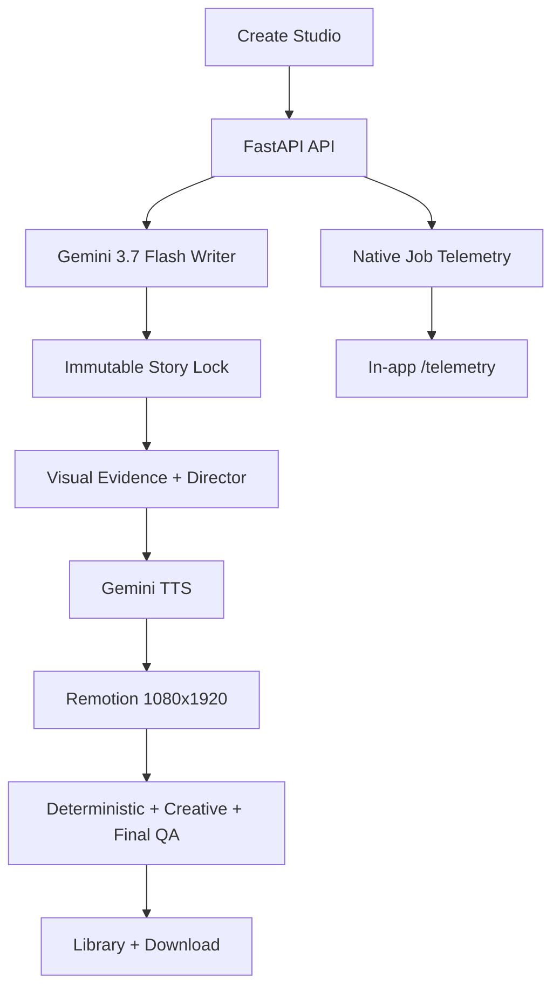

# FYF Video Pipeline — Agentic Cinema

Evidence-led Burmese AI video generation with Gemini, native telemetry, and deterministic Remotion rendering.

> [!NOTE]
> **Current Status:** Verified local-first production path — real browser UI, Vertex/Gemini generation, Gemini TTS, Remotion rendering (segmented strategy with per-segment checkpoints), deterministic QA, creative QA, final visual QA, Library playback, and in-app Telemetry are working. Production hosting runs on **Google Cloud Run**; production telemetry mirrors into **ClickHouse Cloud**, and the built-in **FYF Data Officer** agent answers questions about that data through the official `mcp-clickhouse` MCP server.
>
> Entering the Google Cloud Agentic Cinema hackathon on the **ClickHouse partner track** — see [DEVPOST_SUBMISSION.md](DEVPOST_SUBMISSION.md) and the decision records in [docs/decisions/](docs/decisions/).
>
> New here? Start with [docs/DEVELOPER_GUIDE.md](docs/DEVELOPER_GUIDE.md) — setup, environment reference, testing, deployment, and operational failure modes (including why the lock stage uses forced function calling: [ADR-003](docs/decisions/ADR-003-forced-function-calling.md)).

> [!WARNING]
> **Release boundary**
> This public snapshot excludes credentials, local job output, non-public voice assets, raw provider payloads, internal agent instructions, and one-off recording/operator scripts. It has an owner-only access pass for an explicitly enabled public demo, not end-user authentication, billing, or tenant isolation.

## Repository boundary

The public repository is source-first. Keep production values in an ignored local `.env`, never in `.env.example` or GitHub:

```bash
cp .env.example .env
# Set FYF_VERTEX_API_KEY locally; never paste it into README, code, telemetry, or chat.
```

The local `.env`, `gcp-key.json`, `output/`, reference audio assets, and scratch/build directories remain outside the release tree. Rotate any credential that was ever placed in a tracked or shareable file.

## Purpose

FYF Video Pipeline turns a Burmese topic or draft into a reviewable vertical video. It keeps the factual story lock and the visual evidence plan explicit, instruments every provider call, and only publishes a completed artifact after deterministic and semantic checks pass.

- **Evidence-led:** Fact claims, visual claims, and visible numeric evidence are kept traceable.
- **Flash-first:** Gemini 3.7 Flash is the default text/reasoning route; stage-specific thinking levels are measured in telemetry.
- **Human-reviewable:** The UI exposes progress, QA state, Library output, and cost-confidence labels before an operator shares a video.
- **Deterministic assembly:** Remotion renders a 1080x1920 composition with Burmese captions, mascot motion, visual treatments, and synced Gemini TTS.
- **Partner-ready:** Replit is the hackathon public/demo path; the in-app `/telemetry` view is the canonical operator surface. The post-hackathon local/private product can omit the Replit boundary.

This repository is FYF-only. It does not add end-user authentication, billing, subscriptions, tenant isolation, or automatic Facebook publishing.

## What this product is built to operate

- Topic or draft intake in the Create Studio.
- Google ADK Agent (`fyf_producer`) with tools for topic research, story segment drafting, quality audit, and visual shot planning.
- Gemini 3.7 Flash writer with immutable story locks and bounded retries.
- Controlled dynamic video styles (`fyf_explainer`, `cinematic_continuity`, `evidence_story`).
- Visual evidence planning, deterministic fallback, and final rendered-meaning verification.
- Public generation budget protection, rate limiting, and concurrency guardrails.
- Resumable job architecture with `/api/jobs/{job_id}/resume` for recoverable interruptions.
- Gemini-TTS Burmese narration with audio QA and mouth-cue generation.
- Remotion video rendering with deterministic output QA and creative QA.
- Library playback/download and privacy-safe per-job Vertex/TTS telemetry.

## Current build vs. production path

| Area | Current FYF build | Future reviewed path |
| --- | --- | --- |
| Runtime | Local FastAPI + Next.js + Remotion; Replit demo boundary | Hosted runtime after auth, rate limits, access controls, and storage are separately approved |
| AI | Vertex/Gemini with Gemini 3.7 Flash text and Gemini TTS | Measured quotas, pricing catalog, and operational alerting |
| Storage | Local ignored job folders and privacy-safe telemetry ledger | Approved durable storage with retention and access policy |
| Voice | Gemini mascot voice in hackathon release | Explicitly reviewed partner route and reference handling |
| Observability | Native in-app `/telemetry` dashboard | Reviewed durable telemetry if needed |
| Publishing | Operator downloads a completed video | Separate approval required for any external publishing integration |

## Architecture graph



## Tech stack

- **Backend:** FastAPI, Pydantic, Google Gen AI SDK, Google ADK (`google-adk`), Vertex/Gemini
- **Frontend:** Next.js App Router, React, TypeScript, Tailwind
- **Video:** Remotion, React, TypeScript, FFmpeg
- **Voice:** Gemini-TTS
- **Observability:** Local privacy-safe ledger, in-app telemetry UI
- **Deployment boundary:** Replit configuration is included for the public/demo runtime boundary

## Local setup

### Backend

```bash
uv sync
cp .env.example .env
# Set FYF_VERTEX_API_KEY in .env
FYF_RUNTIME_MODE=hackathon .venv/bin/python -B -m uvicorn backend.main:app --host 127.0.0.1 --port 8000
```

### Frontend

```bash
cd frontend
npm ci
NEXT_PUBLIC_FYF_RUNTIME_MODE=hackathon npm run dev -- --port 3001
```

Open:

- Create Studio: `http://localhost:3001`
- Video Library: `http://localhost:3001/library`
- Telemetry: `http://localhost:3001/telemetry`

Replit runs the same public/demo surface through `run_replit.sh`, which uses the locked Python environment, builds/starts Next.js in production mode, and proxies `/api/*` and `/health` through the same hosted origin. It defaults to the Google voice route unless explicitly overridden.

### Public demo host safety

Set `FYF_PUBLIC_DEPLOYMENT=true` in the host deployment configuration. This makes every paid generation endpoint fail closed by default; the UI will show **Generation unavailable** rather than a misleading readiness signal.

Only for a deliberately capped, owner-operated demonstration, configure these values in the host **secret store**, never in Git or client-side variables:

- `FYF_VERTEX_API_KEY` — the approved Vertex Express credential.
- `FYF_GENERATION_ACCESS_TOKEN` — an operator-controlled access pass. The browser keeps it in session storage and sends it only as `X-FYF-Access-Token` to same-origin generation requests.
- `FYF_PUBLIC_GENERATION_ENABLED=true` — explicit operator enablement.
- `FYF_DAILY_BUDGET_CAP_USD`, `FYF_TOTAL_BUDGET_CAP_USD`, `FYF_RATE_LIMIT_PER_MINUTE`, and `FYF_MAX_CONCURRENT_JOBS=1` — set a small reviewed cap before a test.

Public restarts never auto-resume paid jobs. A restart leaves work for an authenticated operator to resume deliberately, preventing a disabled host from unexpectedly spending provider credits.

## Verification evidence

- Backend regression & ADK agent suite: **358 tests passed**.
- Voice adapter/audio QA suite: **23 tests passed**.
- Remotion suite: **27 tests passed**.
- Frontend ESLint, TypeScript, and production build passed.
- `uv lock --check`, shell syntax, import checks, and public-tree scans passed.
- Public demo run: **50.86s** video, Gemini TTS, deterministic/creative/final QA passed.
- A private end-to-end run was completed locally; raw job identifiers, provider payloads, and private cost records are intentionally omitted from this public snapshot.
- The public demo path was exercised through the browser from script creation to rendered video, Library playback/download, and Telemetry inspection. Exact provider usage remains in the local ignored job ledger.
- Browser verification covered Create, real generation, Library preview/download, and Telemetry selection for a completed job.

## ClickHouse partner-track integration

Every completed generation dual-writes sanitized telemetry into ClickHouse Cloud (`video_pipeline_jobs`, `video_qa_records`, `video_scene_telemetry`, `video_vertex_calls`). The **FYF Data Officer** agent — built with Google ADK and the official [`mcp-clickhouse`](https://github.com/ClickHouse/mcp-clickhouse) MCP server — answers natural-language questions about that warehouse at runtime:

```bash
curl -X POST https://<your-cloud-run-url>/api/insights \
  -H "Content-Type: application/json" \
  -d '{"question": "How many jobs passed QA this week?"}'
```

Configuration is environment-driven (`CLICKHOUSE_HOST`, `CLICKHOUSE_PORT`, `CLICKHOUSE_USER`, `CLICKHOUSE_PASSWORD`); without it the feature disables itself gracefully.

## Deploying to Google Cloud Run

```bash
gcloud auth login
google_cloud_project=<your-project> bash scripts/deploy_cloudrun.sh
```

The script enables required APIs, creates the Artifact Registry repository, uploads ClickHouse credentials to Secret Manager, builds the multi-stage image via Cloud Build, and deploys a gen2 Cloud Run service (Next.js standalone front door, FastAPI backend, Remotion + headless browser inside). See [docs/PROJECT_STRUCTURE.md](docs/PROJECT_STRUCTURE.md) for the repository map and [docs/decisions/](docs/decisions/) for the reasoning behind the architecture.

## License

MIT — see [LICENSE](LICENSE).
